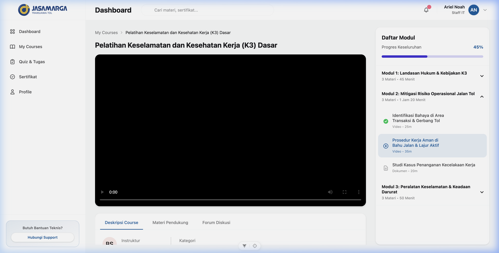
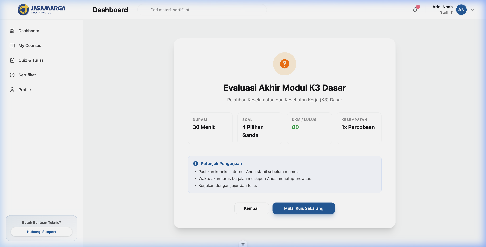
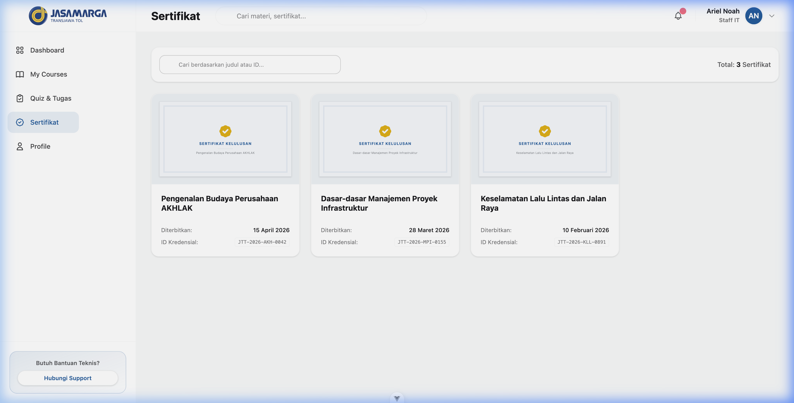
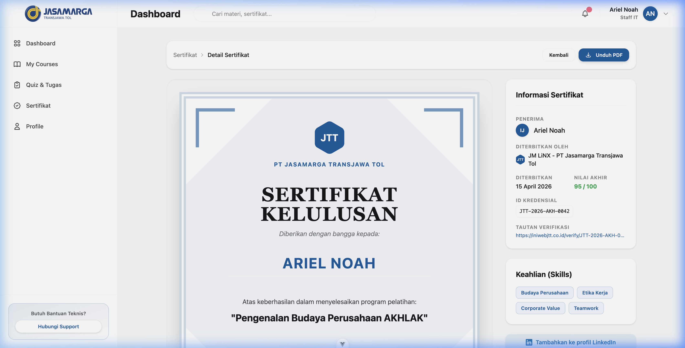

# JM LiNX - Frontend

### Preview








### Setup

```bash
pnpm install
pnpm dev
```

### Scripts

- `pnpm build` (Production build)
- `pnpm format` (Prettier)
- `pnpm preview` (Local preview)

### Tech Stack

- Vue 3, Vite, Tailwind CSS, DaisyUI, Pinia
